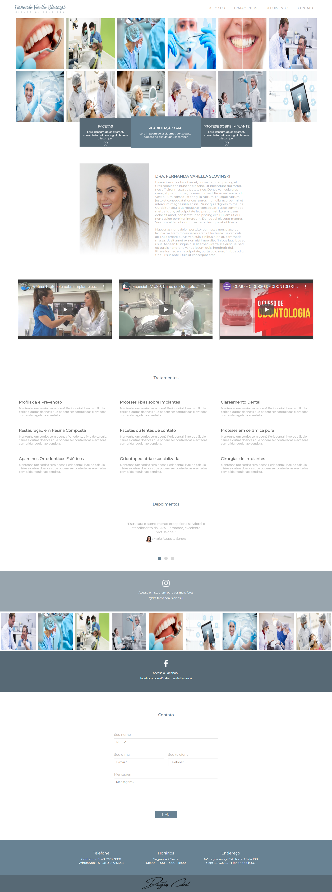

# Site Dentista

* 5º projeto, feito em HTML, CSS, JavaScript e JQuery.
* Projeto desenvolvido no curso de Front-End da Danki Code.
* Site responsivo para todas as plataformas.
* JQuery utilizado para passar as fotos para o lado no banner e para ver os depoimentos.